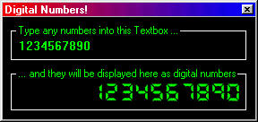



## Digital Number Generator

### Description

This code displays the numbers that you type into a textbox as digital numbers!

Vote for me if you like it!
 
### More Info
 

             |
---                |---
**Submitted On**   |2000-09-21 17:14:28
**By**             |[Druid Developing](https://github.com/Planet-Source-Code/PSCIndex/blob/master/ByAuthor/druid-developing.md)
**Level**          |Beginner
**User Rating**    |4.8 (24 globes from 5 users)
**Compatibility**  |VB 5\.0, VB 6\.0
**Category**       |[Graphics](https://github.com/Planet-Source-Code/PSCIndex/blob/master/ByCategory/graphics__1-46.md)
**World**          |[Visual Basic](https://github.com/Planet-Source-Code/PSCIndex/blob/master/ByWorld/visual-basic.md)
**Archive File**   |[CODE\_UPLOAD100399212000\.zip](https://github.com/Planet-Source-Code/druid-developing-digital-number-generator__1-11587/archive/master.zip)

### API Declarations

NONE!

